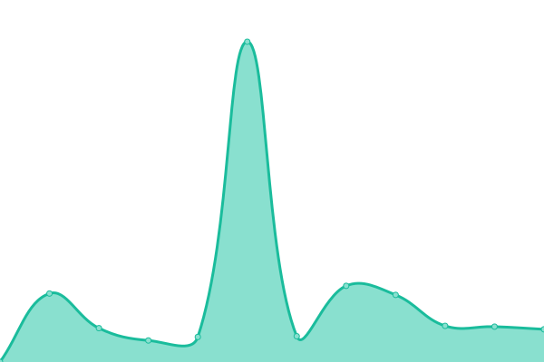

# [📈 Live Status](https://status.assetmantle.one): <!--live status--> **🟧 Partial outage**

This repository contains the open-source uptime monitor and status page for [AssetMantle](https://assetmantle.one), powered by [Upptime](https://github.com/upptime/upptime).

With [Upptime](https://upptime.js.org), you can get your own unlimited and free uptime monitor and status page, powered entirely by a GitHub repository. We use [Issues](https://github.com/AssetMantle/status/issues) as incident reports, [Actions](https://github.com/AssetMantle/status/actions) as uptime monitors, and [Pages](https://status.assetmantle.one) for the status page.

<!--start: status pages-->
<!-- This summary is generated by Upptime (https://github.com/upptime/upptime) -->
<!-- Do not edit this manually, your changes will be overwritten -->
<!-- prettier-ignore -->
| URL | Status | History | Response Time | Uptime |
| --- | ------ | ------- | ------------- | ------ |
|  [AssetMantle Website](https://assetmantle.one) | 🟩 Up | [asset-mantle-website.yml](https://github.com/AssetMantle/status/commits/HEAD/history/asset-mantle-website.yml) | 

 209ms
     
 | 

<a href="https://status.assetmantle.one/history/asset-mantle-website">100.00%</a>
    

|  [AssetMantle Wallet](https://wallet.assetmantle.one) | 🟩 Up | [asset-mantle-wallet.yml](https://github.com/AssetMantle/status/commits/HEAD/history/asset-mantle-wallet.yml) | 

 213ms
     
 | 

<a href="https://status.assetmantle.one/history/asset-mantle-wallet">100.00%</a>
    

|  [AssetMantle Explorer](https://explorer.assetmantle.one) | 🟩 Up | [asset-mantle-explorer.yml](https://github.com/AssetMantle/status/commits/HEAD/history/asset-mantle-explorer.yml) | 

 956ms
     
 | 

<a href="https://status.assetmantle.one/history/asset-mantle-explorer">100.00%</a>
    

|  [AssetMantle Airdrop](https://airdrop.assetmantle.one) | 🟩 Up | [asset-mantle-airdrop.yml](https://github.com/AssetMantle/status/commits/HEAD/history/asset-mantle-airdrop.yml) | 

 139ms
     
 | 

<a href="https://status.assetmantle.one/history/asset-mantle-airdrop">100.00%</a>
    

|  [AssetMantle Marketplace](https://marketplace.assetmantle.one) | 🟥 Down | [asset-mantle-marketplace.yml](https://github.com/AssetMantle/status/commits/HEAD/history/asset-mantle-marketplace.yml) | 

 672ms
     
 | 

<a href="https://status.assetmantle.one/history/asset-mantle-marketplace">99.60%</a>
    

|  [AssetMantle Blog](https://blog.assetmantle.one) | 🟩 Up | [asset-mantle-blog.yml](https://github.com/AssetMantle/status/commits/HEAD/history/asset-mantle-blog.yml) | 

 1409ms
     
 | 

<a href="https://status.assetmantle.one/history/asset-mantle-blog">100.00%</a>
    

|  [AssetMantle Documentation](https://docs.assetmantle.one) | 🟩 Up | [asset-mantle-documentation.yml](https://github.com/AssetMantle/status/commits/HEAD/history/asset-mantle-documentation.yml) | 

 357ms
     
 | 

<a href="https://status.assetmantle.one/history/asset-mantle-documentation">100.00%</a>
    

|  [AssetMantle RPC](https://rpc.assetmantle.one/net_info) | 🟩 Up | [asset-mantle-rpc.yml](https://github.com/AssetMantle/status/commits/HEAD/history/asset-mantle-rpc.yml) | 

 693ms
     
 | 

<a href="https://status.assetmantle.one/history/asset-mantle-rpc">100.00%</a>
    

|  [AssetMantle REST](https://rest.assetmantle.one/node_info) | 🟩 Up | [asset-mantle-rest.yml](https://github.com/AssetMantle/status/commits/HEAD/history/asset-mantle-rest.yml) | 

 559ms
     
 | 

<a href="https://status.assetmantle.one/history/asset-mantle-rest">100.00%</a>
    

<!--end: status pages-->

[**Visit our status website →**](https://status.assetmantle.one)

## 📄 License

- Powered by: [Upptime](https://github.com/upptime/upptime)
- Code: [MIT](./LICENSE) © [AssetMantle](https://assetmantle.one)
- Data in the `./history` directory: [Open Database License](https://opendatacommons.org/licenses/odbl/1-0/)
